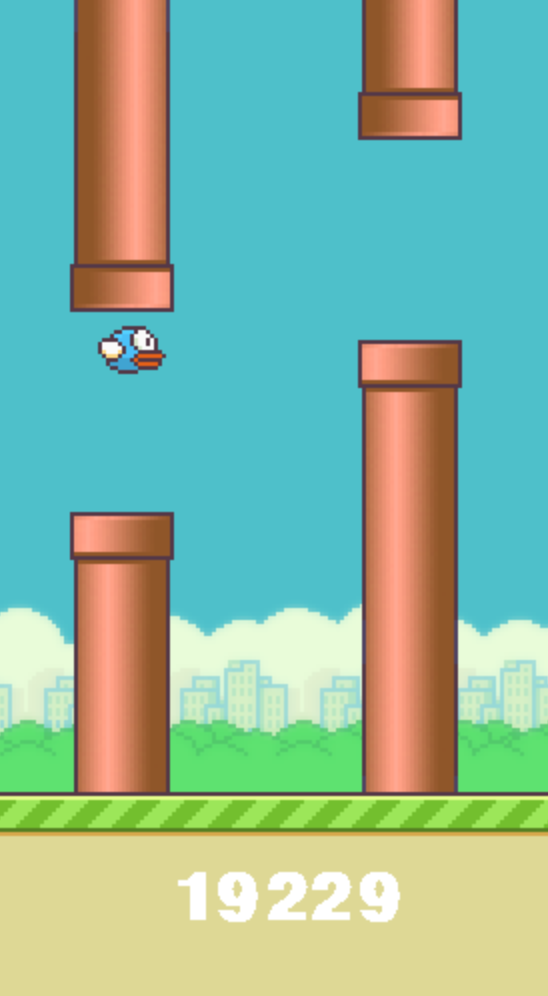

# CS 394R: Learning to Survive in Flappy Bird
Authors: Sai Kiran Maddela and Vivek Ramanathan
{sai_kiran_maddela, vivekramanathan}@utexas.edu

Last Updated: May 9, 2022



## RL Implementations

We present our implementations of Reinforcement Learning algorithms that learn to play the Flappy Bird game. Please see the corresponding report for more details about the Flappy Bird state space, action space, and choices made while developing these algorithm implementations. The game emulator we used and its corresponding user and installation documentation can be found [here](https://github.com/ntasfi/PyGame-Learning-Environment).

Every implementation described below trains the algorithm for a specified amount of episodes (this varies per file and can be easily changed) and, since these are tabular methods, saves the final Q matrix learned to a serialized ".pkl" file. This Q matrix then contains the value approximations for each state-action pair, and can then be run or validated over several runs.

In general, to start learning using any of the algorithms, execute:

```
python <algorithm-name>.py
```
and to validate the resulting Q matrix produced on training on 100 games, execute:

```
python flappy-validate.py <path-to-pkl-file>
```

For example, after training SARSA, the serialized file saved might be called "sarsa_eps_0p0_learning.pkl". To validate the resulting matrix over another 100 games, execute the following command:

```
python flappy-validate.py sarsa_eps_0p0_learning.pkl
```

The validation script prints the average and max score achieved by the algorithm over the 100 games.

### SARSA

To start learning using SARSA, execute the following command:

```
python sarsa.py
```

### n-step SARSA

To start learning using n-step SARSA, execute the following command:

```
python n_step_sarsa.py
```

### Q-learning

To start learning using Q-learning, execute the following command:

```
python qlearning.py
```

### Monte Carlo

To start learning using Monte Carlo, execute the following command:

```
python monte_carlo.py
```

### Double Q-learning

To start learning using Double Q-learning, execute the following command:

```
python double_qlearning.py
```

### True Online SARSA($\lambda$)

To start learning using SARSA($\lambda$), execute the following command:

```
python sarsa_lambda.py
```

## Deep Learning Approaches

There are also a few files that contain our attempts at implementing deep RL algorithms. We did not have sufficient time or computational resources to complete testing these approaches, but these serve as a good starting point for hyperparameter/neural network architecture search to create a good Flappy Bird agent.

### Deep Q-Learning

To start learning using deep q-learning approaches, execute the following commands:

For deep q-learning using the game image, rather than our state space defined in the report,
```
python image_deep_ql.py
```

For double deep q-learning using the game image,
```
python image_double_deep_ql.py
```

For double deep q-learning using our state space,
```
python state_double_deep_ql.py
```

### Actor Critic

To start learning using a one-step actor-critic method, execute the following command:

```
python actor_critic.py
```

### Note

The .pkl files we used in our experiments are too large for GitHub due to the size of our state space (> 100 MB each). However, we can provide these .pkl files on request. 
